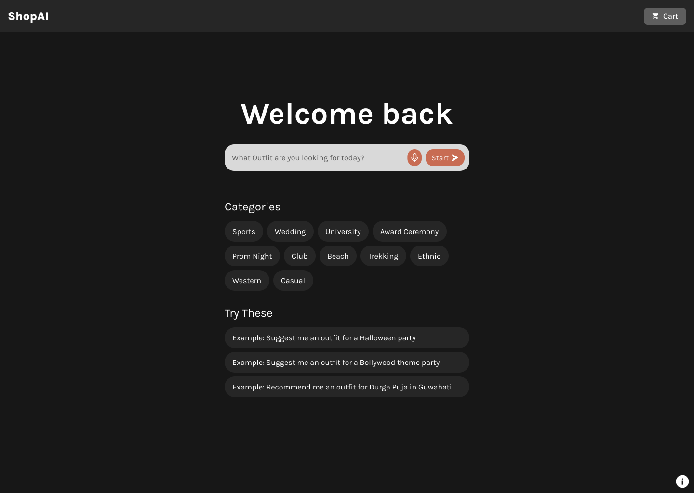
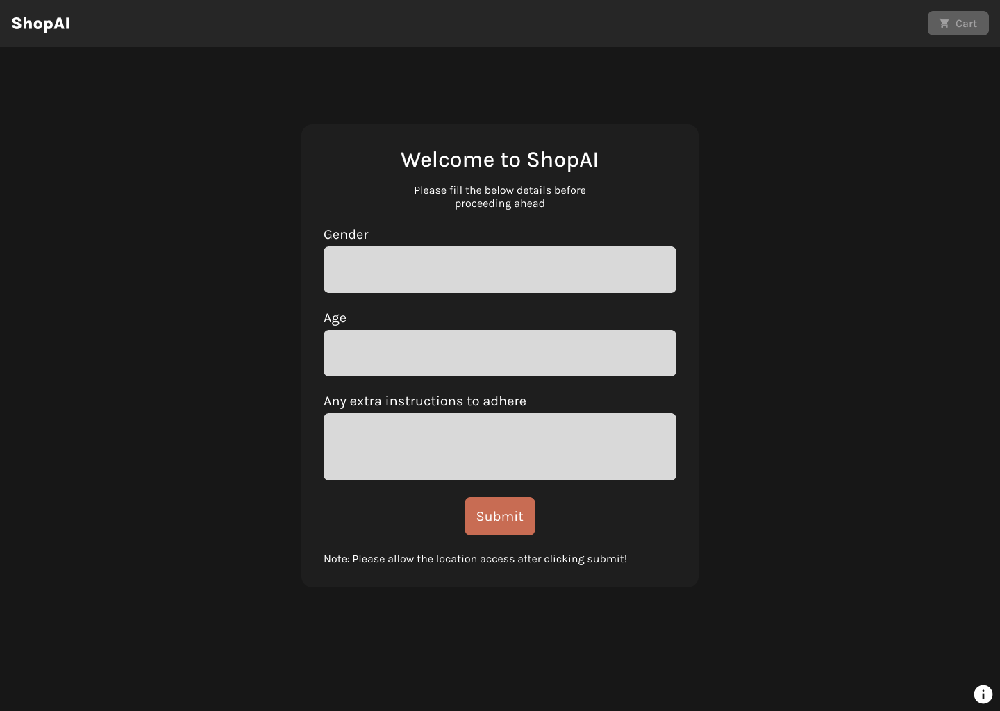
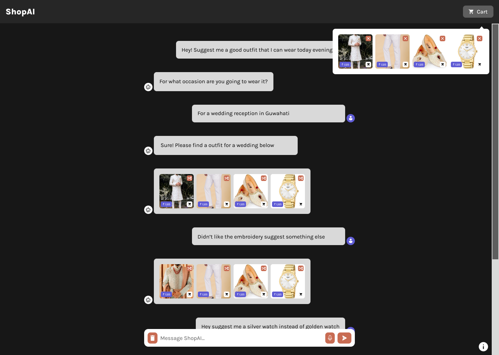
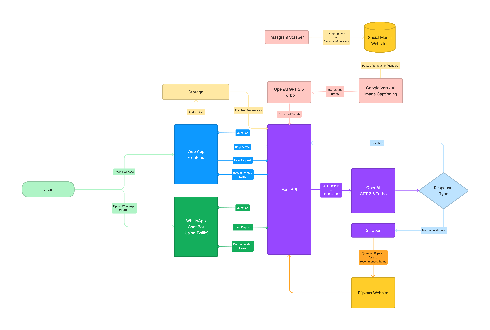

<p align="center">
    
</p>

# ShopAI

Your own personalised wardrobe recommender!

## Screenshots

Onboarding                     |  Search Page                |  Chat Page                |
:-----------------------------:|:---------------------------:|:-------------------------:|
|  |  |

## How it works

## Dev

### Prerequisites

**Packages**

- Node Version: v18.x
- Package Manager: Yarn
- Python Version: >= v3.10
- GCP Cli: https://cloud.google.com/sdk/docs/install
- ngrok (for whatsapp chatbot): https://ngrok.com/download

**Configs Required**

- GCP Project Config
  - Make sure Vertex AI and Vision AI is enabled in API & Services
  - Rename the file as gcpconfig.json and place it in the `backend` directory
- Create an `.env` file with the following content
  ```
  OPEN_AI_API_KEY=<OPENAI_API_KEY>
  TWILIO_SID=<TWILIO_SID>
  TWILIO_AUTH_TOKEN=<TWILIO_AUTH_TOKEN>
  GCP_ACCESS_TOKEN=<GCP_ACCESS_TOKEN> # gcloud auth print-access-token
  GCP_PROJECT_ID=<GCP_PROJECT_ID> # Copy and Paste from gcpconfig.json
  ```

**Install Dependencies**

Note: Create a Virtual Env before running the below commands

1) Install frontend packages
   ```bash
   cd frontend && yarn && cd ..
   ```

2) Install backend packages
   ```bash
   cd backend && pip install -r requirements.txt && cd ..
   ```

**Running the app**

1) Scraping the Content (a cron job can be setup if running in production)
   ```bash
   cd backend && python instaScraper.py && cd ..
   ```

2) Analyzing the trend (a cron job can be setup if running in production)
   ```bash
   cd backend && python trendsAnalyzer.py && cd ..
   ```

1) Start the Frontend Server
   ```bash
   cd frontend && yarn build && yarn preview
   ```

2) In second terminal, start the backend server
   ```bash
   cd backend && uvicorn main:app --reload
   ```

**Running the ChatBot**

1) Make sure the backend server is on. You can turn it on by running the following command in the backend directory
   ```bash
   cd backend && uvicorn main:app --reload
   ```

2) Tunnel the backend through ngrok (in second terminal)
   ```bash
   ngrok http 8000
   ```

3) Change the Sandbox Configuration in Try Whatsapp section of your twilio app. [Click here for steps](https://www.twilio.com/blog/inventory-chatbot-whatsapp-fastapi)

## References

- GCP Vertex AI Vision Service API: https://cloud.google.com/vertex-ai/docs/generative-ai/image/image-captioning#img-cap-rest

- ChatGPT Prompt Engineering for Developers: https://www.deeplearning.ai/short-courses/chatgpt-prompt-engineering-for-developers/
